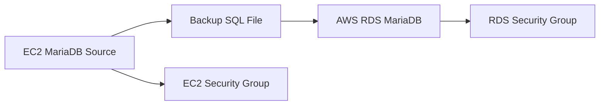
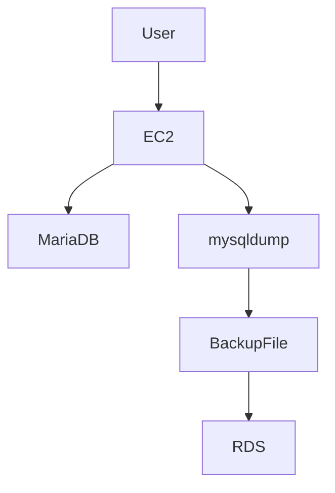
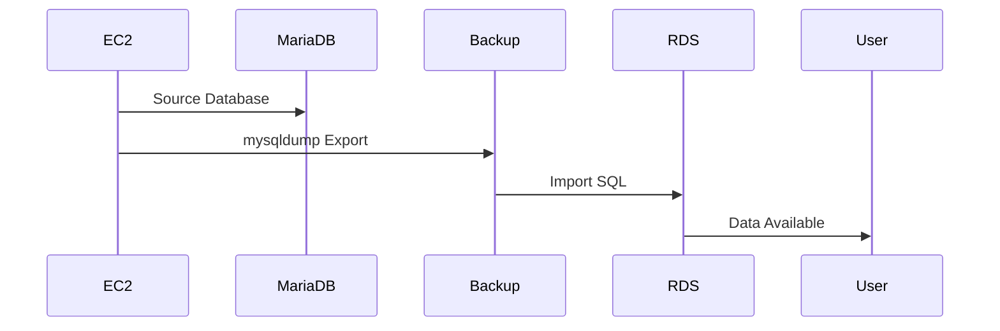

<!-- 🌈 TOP CLOUD MIGRATION BANNER -->

<p align="center">

</p>

---

# 🚀 Data Migration: EC2 (MariaDB) → AWS RDS (MariaDB)

<h3 align="center">Production Style Cloud Database Migration Guide</h3>

---

<p align="center">


</p>

---

# 🌟 Project Vision

This project demonstrates **real-world database migration** from a self-managed MariaDB running on EC2  
to a fully managed AWS RDS MariaDB instance.

This simulates how enterprise cloud teams move workloads from VM-based databases to managed cloud services.

---

# 🧭 Migration Objective

✔ Backup database from EC2  
✔ Transfer data safely  
✔ Restore into AWS RDS  
✔ Validate migration integrity  
✔ Apply cloud security best practices  

---

# 🏗️ Full Migration Architecture



---

# ☁ Cloud Infrastructure View



---

# ✅ Prerequisites

✔ AWS Account  
✔ EC2 + RDS Permissions  
✔ AWS CLI Configured  
✔ SSH Key Pair  
✔ Basic MariaDB Knowledge  

💡 Pro Tip → Use AWS Secrets Manager for DB credentials.

---

# 💻 Step 1 — Launch EC2 (Linux)

Ubuntu 22.04 OR Amazon Linux 2023  
Instance: t3.micro  
Security: Allow SSH (22)

SSH Login:

```bash
ssh -i my-key.pem ubuntu@EC2_PUBLIC_IP
```

---

# 🧱 Step 2 — Install MariaDB

```bash
sudo apt update
sudo apt install mariadb-server mariadb-client -y
sudo systemctl enable --now mariadb
sudo mysql_secure_installation
```

Verify:

```bash
systemctl status mariadb
```

---

# 🧑‍💼 Step 3 — Create Database & Table

```sql
CREATE DATABASE employee_db;

CREATE USER 'emp_user'@'%' IDENTIFIED BY 'EmpUserPassword123!';
GRANT ALL PRIVILEGES ON employee_db.* TO 'emp_user'@'%';
FLUSH PRIVILEGES;

USE employee_db;

CREATE TABLE employee(
 id INT AUTO_INCREMENT PRIMARY KEY,
 first_name VARCHAR(50),
 last_name VARCHAR(50),
 email VARCHAR(100),
 department VARCHAR(50),
 hire_date DATE,
 salary DECIMAL(10,2)
);
```

---

# 💾 Step 4 — Backup Database

```bash
mysqldump -u root -p employee_db > employee_db_backup.sql
```

---

# ☁ Step 5 — Setup RDS Networking

Create:

✔ DB Subnet Group  
✔ RDS Security Group  
✔ Allow Port 3306 from EC2 SG  

---

# 🗄 Step 6 — Create RDS MariaDB

```bash
aws rds create-db-instance \
--db-instance-identifier my-mariadb-rds \
--allocated-storage 20 \
--db-instance-class db.t3.micro \
--engine mariadb \
--master-username admin \
--master-user-password RdsAdminPass123! \
--publicly-accessible true
```

---

# 📤 Step 7 — Restore Backup to RDS

```bash
mysql -h RDS_ENDPOINT -u admin -p employee_db < employee_db_backup.sql
```

---

# 🔍 Step 8 — Verify Migration

```sql
SELECT * FROM employee;
```

---

# 🎯 Migration Flow (Sequence View)



---

# 🧹 Cleanup & Best Practices

✔ Delete unused EC2  
✔ Restrict RDS Security Group  
✔ Store backup in S3  
✔ Enable RDS Auto Backup  

---

# 🧠 Production Tips

🔥 Use AWS DMS for Live Migration  
🔥 Use Multi-AZ RDS  
🔥 Enable Performance Insights  
🔥 Enable Encryption  

---

# 👨‍💻 Author

**Arkan Tandel**  
Cloud & DevOps Engineer 🚀  

GitHub: https://github.com/arkantandel  
Email: arkantandel@gmail.com  

---

# ❤️ Cloud Engineering Quote

> Migration isn’t magic.  
> It’s mastering the controlled movement of data across systems.

---

<!-- FOOTER BANNER -->

<p align="center">

</p>

